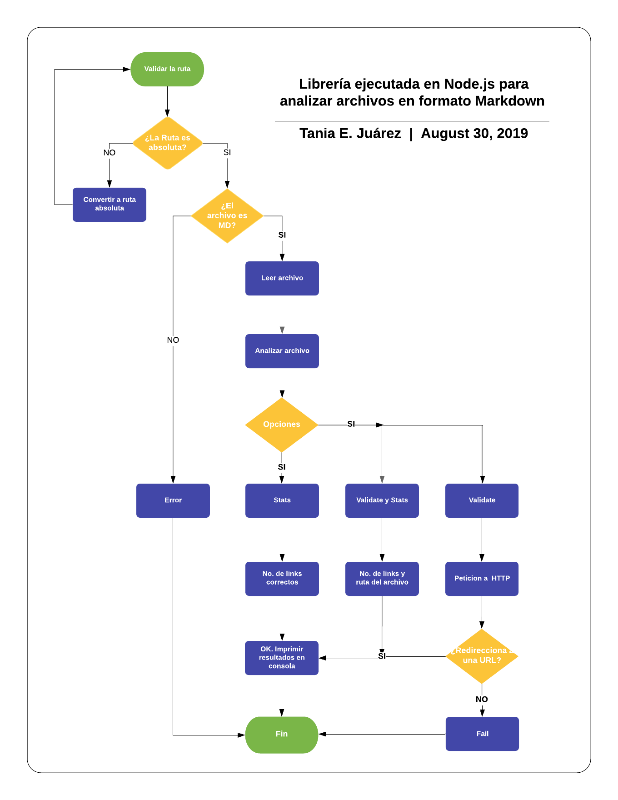

# Markdown Links

## Diagrama de flujo
El siguiente diagrama de flujo, muestra el algoritmo para la ejecución de la libreria con Node.js

## Recursos y Tópicos a consultar en este Proyecto

- [Markdown](https://es.wikipedia.org/wiki/Markdown)
- [Node.js](https://nodejs.org/)
- [módulos (CommonJS)](https://nodejs.org/docs/latest-v0.10.x/api/modules.html).
- [file system](https://nodejs.org/api/fs.html).
- [path](https://nodejs.org/api/path.html).
- [http.get](https://nodejs.org/api/http.html#http_http_get_options_callback).
- [Parsing](https://en.wikipedia.org/wiki/Parsing).
- [markdown](https://daringfireball.net/projects/markdown/syntax).
- [CLI](https://www.proyectobyte.com/windows/simbolo-del-sistema/uso-la-interfaz-linea-comandos).
- [npm-scripts](https://docs.npmjs.com/misc/scripts).
- [semver](https://semver.org/).

